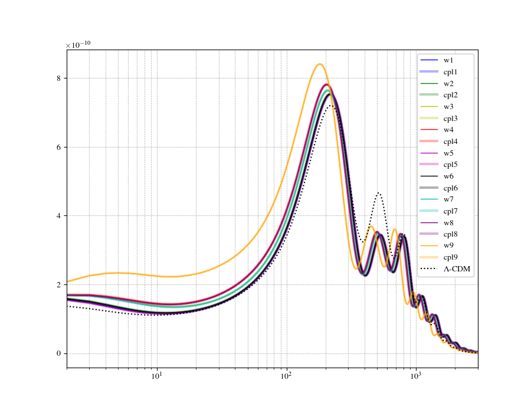
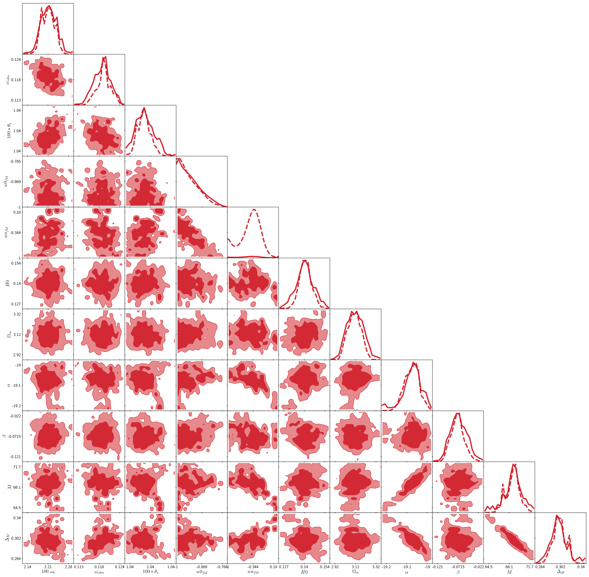
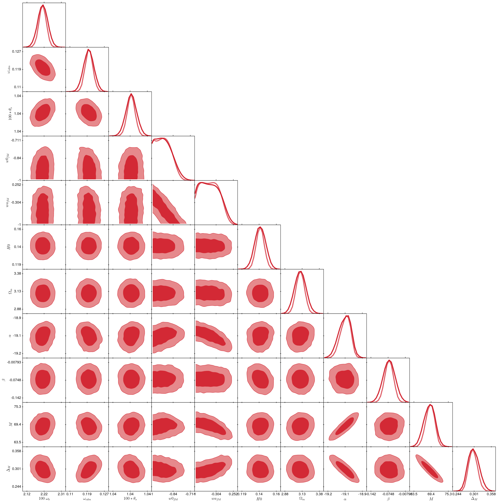

# CLASS: Cosmic Linear Anisotropy Solving System

## Venadito Cósmico version
#### A five-parameter Dark Energy Parameterization 

Venadito cósmico is a flexible equation-of-state (EoS) w(z) and w(a) that tries to parametrize the behavior of Dark Energy at close and medium redshifts. The equation can be expanded from a 2-parameter eq. to a 5 parameter eq. and is also reducible to Lambda-CDM model (i.e. w=-1). It is to be tested using CLASS + MontePython codes using BAO, SNa, H(z) and Planck datasets.

The purpose of the following images is to link the scientific research being conducted, with the cosmogonic understanding of the Universe of the Wixarika and Nahua cultures in pre-hispanic Mexico, not just as an aesthetic analogy between numbers (N=1,2,3,4) and deities (Sun, Hawk, Deer, Peyote and Tlacuache) but as a test of reconciliation between the scientific work and the mithological tradition; two disciplines that appear to be antagonistic but may coexist peacefully and nourish from each other, making the scientific labour a more humane and diverse activity.

This is a work in progress.

##### Software and code in use:

- [CLASS 2](https://github.com/lesgourg/class_public)
- [MontePython 2](https://monte-python.readthedocs.io/en/latest/index.html)
- Wolfram Mathematica
- Intel Fortran Compiler
- Open MPI
- Python
- and ImageMagick for .pdf -> .png conversions

### A. The Myth of the origin of the Universe according to Wixarika and Nahua cultures

 

#### El universo: Nealika (El Sol) (N=1), Piwami (El Halcón) (N=2), Kauyumari (El Venado) (N=4) y Hikuri (El Abuelo)
#### El amigo Nahua que trae el fuego: Tlacuatzin (N=3)

<!--otra imagen (cuervo) en "https://i.pinimg.com/originals/68/0a/b0/680ab0766d762f58282bf73b42b1a20b.jpg"-->

### B. The pictographical results so far...

<h4> 1. Matter Power Spectrum of w(N=1) vs CPL parametrizations, computed with CLASS 2</h4>

<h4> 2. A MontePython run in which parameters w0 and w1 are tested with Planck and JLA data</h4>

<h5> 2.1 Run on Laptop with 4 cores and 5000 chains </h5>

<h5> 2.2 Run on cluster with 16 cores and 20,000 chains </h5>

*************************************************************************
## Claudio Nahmad Arcaraz | 2018
#### BSc. Thesis at Instituto de Física UNAM for physics bachelor's degree
  - Check out more on the thesis work [here](https://github.com/ClaudioNahmad/thesis_BSc)
  - Check out more on installing the required tools for cosmological parameter exploration [here](https://github.com/ClaudioNahmad/Servicio-Social)
