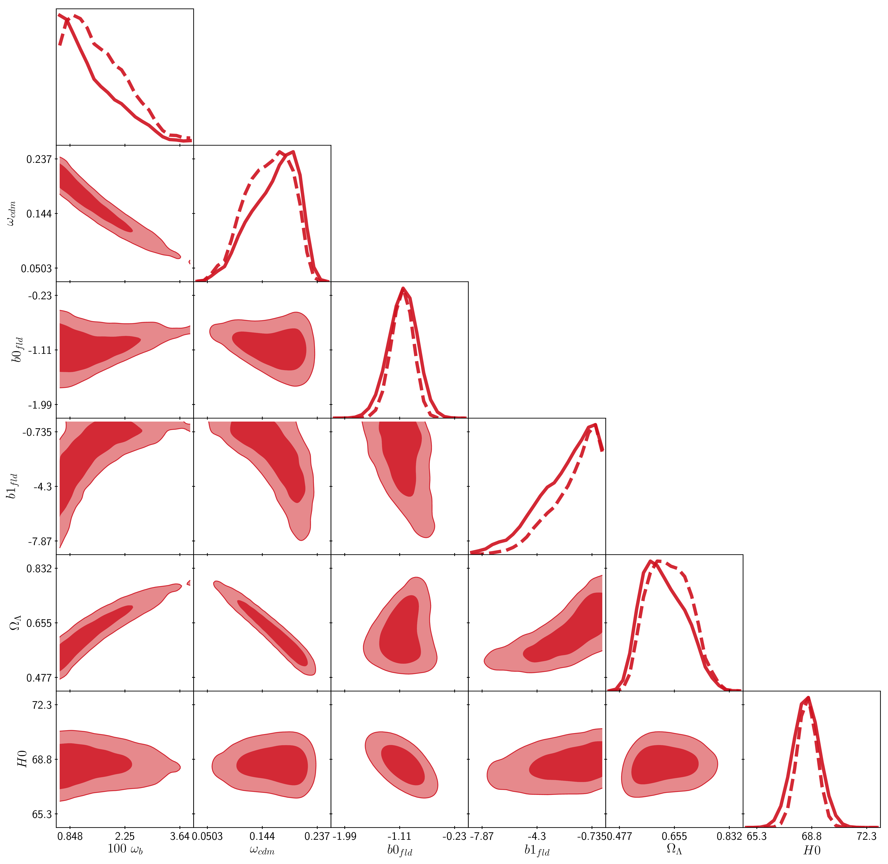

# CLASS: Cosmic Linear Anisotropy Solving System

## Venadito Cósmico version
#### A five-parameter Dark Energy Parameterization 

Venadito cósmico is a flexible equation-of-state (EoS) w(z) and w(a) that tries to parametrize the behavior of Dark Energy at close and medium redshifts. The equation can be expanded from a 2-parameter eq. (N=1) to a 5 parameter eq. (N=4) and is also reducible to Lambda-CDM model (i.e. w=-1) with N=0. It is to be tested using CLASS + MontePython codes using BAO, SNa, H(z) and Planck datasets.

##### Software and code in use:

- [CLASS 2.6.3](https://github.com/lesgourg/class_public)
- [MontePython 3.1.0](https://monte-python.readthedocs.io/en/latest/index.html)
- Wolfram Mathematica
- Intel Fortran Compiler
- Open MPI
- Python
- and ImageMagick for .pdf -> .png conversions

<!--The purpose of the following images is to link the scientific research being conducted, with the cosmogonic understanding of the Universe (Tututzi Maxa Kwaxi) of the meso-american Waixarika (Huichol) culture in pre-hispanic Mexico. Not just as an aesthetic analogy between numbers (N=1,2,3,4) and deities (Sun, Eagle, Deer and Peyote) / (Tayau, Tatei Wexica Wimari, Tamatzi Kauyumari and Hikuri) but as a test of reconciliation between the scientific work and the mithological tradition; two disciplines that appear to be antagonistic but may coexist peacefully and nourish from each other, making the scientific labour a more humane and diverse activity.

This is a work in progress.

### A. The Myth of the origin of the Universe according to Wixarika culture

 

#### El universo:
  - Bisabuelo Cola de Venado: El Universo (Tututzi Maxa Kwaxi)
  - Abuela Tierra (imágen de la Tierra) (Tukutzi Nakawe) (e)
  - Abuelo Fuego (Nairy / Tatewari)
  - Padre Sol (Tayau)
  - El Hermano Venado (Tamatzi Kauyumari) (a)
  - Madre Águila (b)
  - Corazón y Plumas de Águila (c,d)
  - Halcón (Piwa'mi) (f)
  - Biznaga de Peyote (Hikuri) (g)

#### Serán simbolizados de la siguiente manera:
  - El Universo con el nombre Kwaxi ó Kwari y con el número N=0
    - equivalente a modelo Lambda-CDM con w=-1
  - El Sol a través de un escudo u "Ojo del Sol": Nearika/Nierika y con el número N=1
    - equivalente a modelo w0wa-CDM / parametrización CPL
  - La Tierra con el nombre Nakawe y el número N=2
    - parametrización con 3 parámetros libres
  - El Águila con el nombre Wimari y el número N=3
    - parametrización con 4 parámetros libres
  - El Venado con el nombre Kauyumari y el número N=4
    - parametrización con 5 parámetros libres-->

<!--otra imagen (cuervo) en "https://i.pinimg.com/originals/68/0a/b0/680ab0766d762f58282bf73b42b1a20b.jpg"-->

### B. The Graphical results so far...

<h4> 1. Temperature Cl of w(N=1) vs CPL parametrizations, computed with CLASS 2</h4>

--------------------------------------------------------------------------------------------------------------------

<h4> 2. A MontePython run in which parameters b_0 and b_1 are tested with data from:
  <ul>
  <li> JLA SNa type-Ia: luminosity distances
  <li> BAO (BOSS DR12): angular distances 
  </ul>
</h4>

<h5> 2.1 Run on Laptop with 4 cores, 10k steps each </h5>

<h5> 2.2 Run on Cluster with 8 cores, 400k steps each </h5>

*************************************************************************
## Claudio Nahmad Arcaraz | 2018 -2020
#### BSc. Thesis at Instituto de Física UNAM for physics bachelor's degree
  - Check out more on the thesis work [here](https://github.com/ClaudioNahmad/thesis_BSc)
  - Check out the montepython repository of this work [here](https://github.com/ClaudioNahmad/montepython-kauyumari)
  - Check out more on installing the required tools for cosmological parameter exploration [here](https://github.com/ClaudioNahmad/Servicio-Social)
